# A Composite ICU Mortality Score from Weights of Evidence

This repository holds the code for the preprint *A Composite ICU Mortality Score from Weights of Evidence of First-Day
Measurements and Interventions Estimated with Channel-Wise Additive Models* (citation link to follow). The score is built from the
first 24 hours of an ICU stay. We developed it on MIMIC-IV, and we validated it, frozen, on 207 hospitals of the eICU Collaborative
Research Database.

## What the method does

Each of nineteen measurements is modeled together with the interventions that act on it, and we call the pair a channel. For each
channel, a generalized additive model estimates a weight of evidence for in-hospital mortality, which states in which direction, and
how strongly, the channel points. The composite score is derived from the channel weights of evidence, and risk is reported as the
observed mortality of the reference-population stratum into which the score of a stay falls.

## Design philosophy

We designed the score so that each of its parts carries a meaning that we chose before estimating it. Section 2 of the paper gives the
argument for each principle.

1. **The weight of evidence is the unit of the score.** Its sign states toward which outcome an aspect of the record points, and its
   magnitude states how far. Weights of evidence from different sources share this unit, so the subscores of the composite score can
   be compared with each other and added.
2. **Measurements are modeled with their interventions.** We view a measurement as an indicator of the health of a physiological
   system and its interventions as the controls applied to bring it back into range. A blood pressure within range may be the pressure
   of a stable patient, or the pressure of a patient held in range by a vasopressor.
3. **The random variables can be described in words.** For each measurement we track how often it left its reference range, how far
   its tail went on the side that its control acts on, and how it trended, and for each intervention the fraction of hours exposed
   and the intensity given that exposure. We apply this construction to each of the nineteen channels, so a fitted function has the
   same reading in every channel.
4. **Each measurement gives one weight of evidence.** The composite score has as many components as there are chosen measurements,
   and the components have a fixed meaning rather than one assigned by an algorithmic allocation of a prediction.
5. **The random variables are estimated as parameters with likelihood models.** A deviation propensity is the same kind of quantity
   for every measurement, so the propensity of creatinine can be placed beside that of mean blood pressure, while their raw deviation
   counts cannot. The likelihood models also account for differences in charting within and between sites.
6. **A channel that was not measured contributes nothing.** It receives a weight of evidence of zero, so missing data are neither
   imputed nor modeled.
7. **Risk is reported against a reference population,** as the observed mortality of a frozen stratum of the score.

## Reading one patient

The patient card presents one stay through the frozen models: the composite score with its band and reference stratum, and each
channel's evidence with its uncertainty. The card below is a high-risk stay from the openly licensed eICU-CRD demo (Open Database
License). A dagger marks the temperature channel, two of whose terms lie outside the support of the training data, so that its
evidence rests on extrapolation of the fitted functions and carries a wide band.

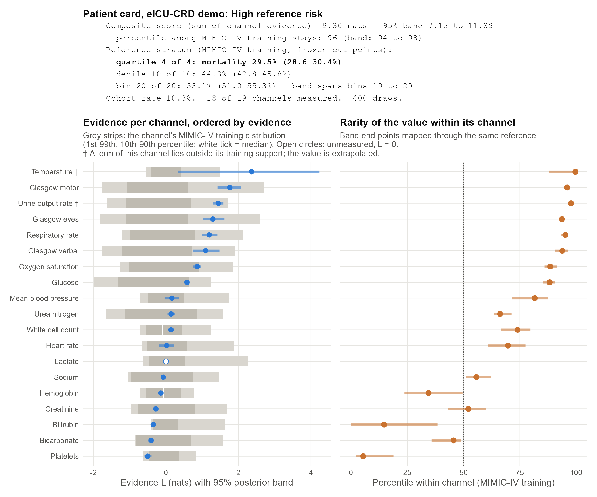

## Key results

**Discrimination and transport.** The evidence sums held their discrimination at eICU better than gradient-boosted trees. The joint
evidence sum kept 90% of its above-chance AUPRC, against 76 to 83% for the boosters, although the boosters discriminated better
within MIMIC-IV.

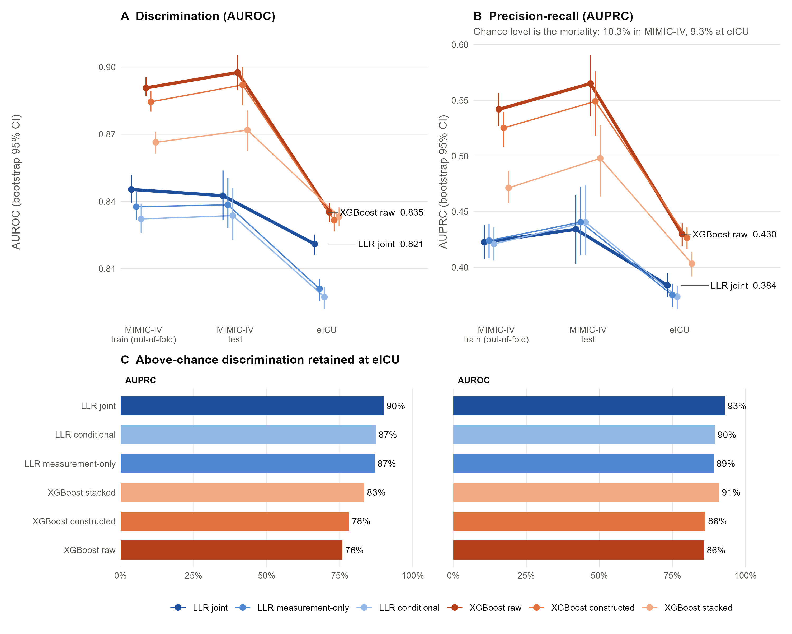

**Comparison with classical severity scores.** Recomputed from the same extraction, APACHE II and SOFA reached an AUPRC of 0.23 to 0.26
at the MIMIC-IV test set, and the evidence sums 0.43 to 0.44.

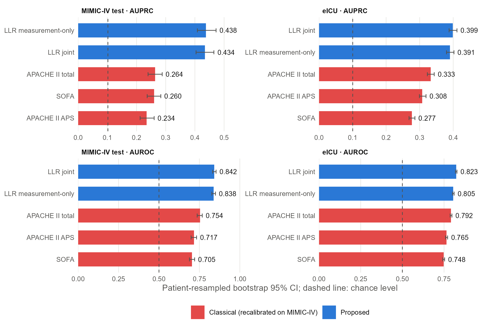

**Risk strata.** Observed mortality rose across the twenty frozen strata of the score at all three sites.

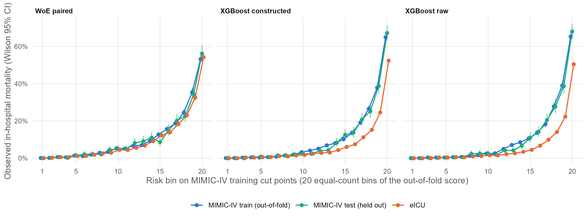

**Reference-risk quartiles.** The quartiles of the evidence sums kept their reference mortality at eICU, with 29.5% in the top quartile
of the training population and 27.3% at eICU, while the top quartiles of the constructed and raw boosters fell to about 19 to 20%
against references of about 32 to 33%.

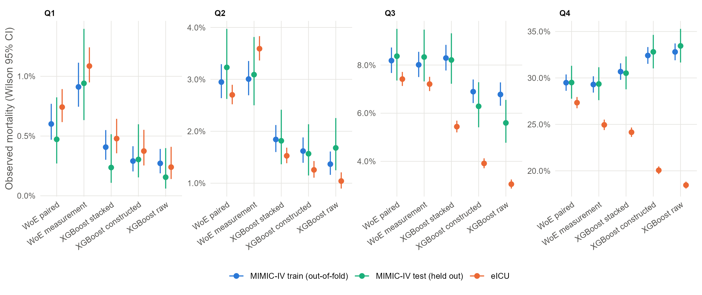

**One channel, term by term.** Each term of a channel model is drawn relative to a quiet day on the channel, and the weight of evidence
of a stay is the reference evidence plus the value of each term. The figure shows the joint model of respiratory rate.

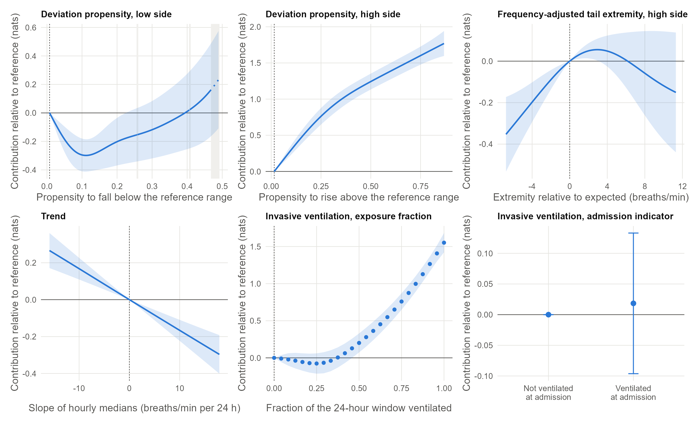

**Measurements with their interventions.** For oxygen saturation, respiratory rate, heart rate and mean blood pressure, adding the
intervention block raised the discrimination of the channel well above that of the measurement alone.

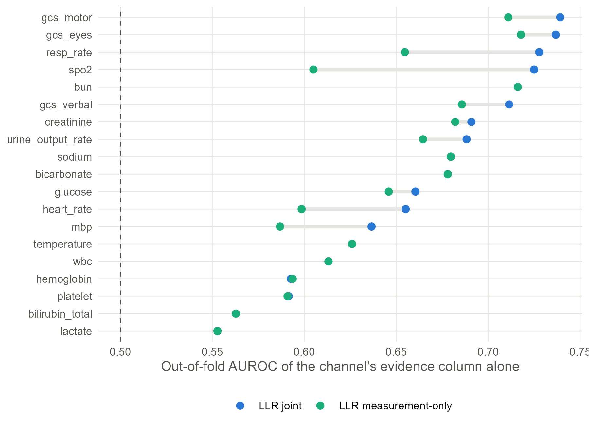

**Reproducibility of per-patient attributions.** When the models were refitted on resampled training data, the leading channel of a
patient changed for 17.4% of patients with the joint evidence model and for 23.2% with SHAP explanations of a booster, and the evidence
model was the more stable on 702 of 703 paired retrainings.

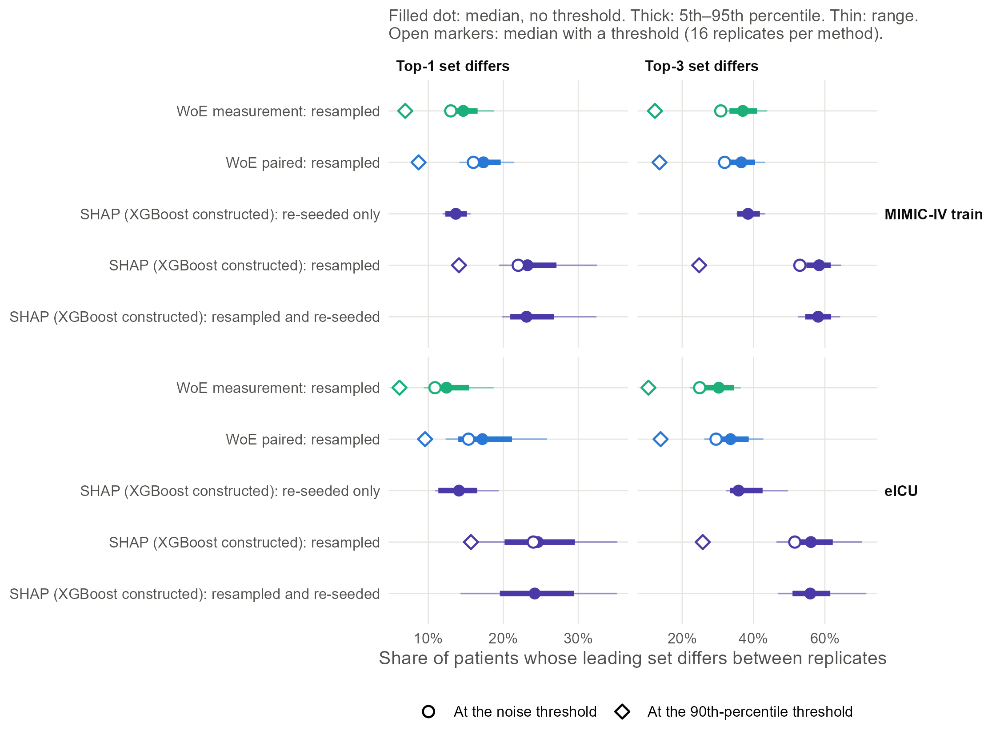

When the leading channel changed under resampling, it usually moved by one rank, and at the 95th percentile by four or five.

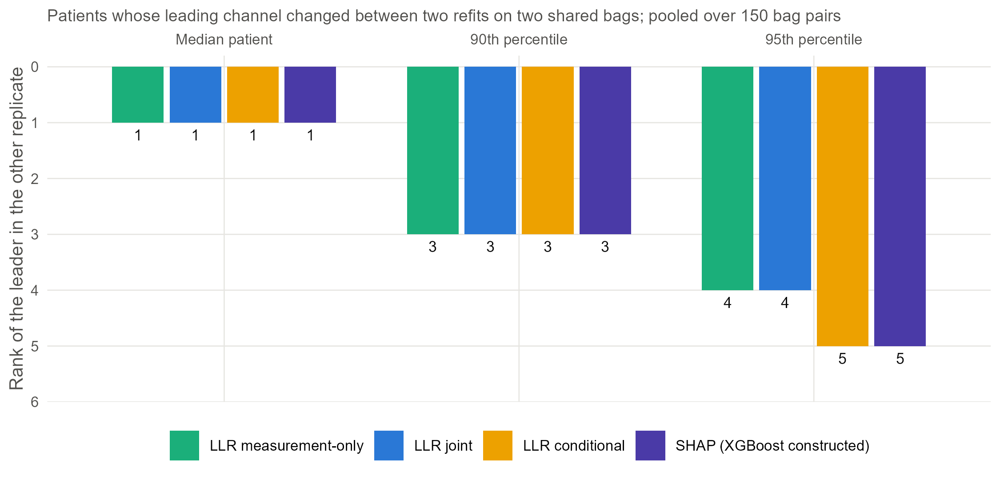

Between the two families, the leading channel of one model often sat far down the ranking of the other.

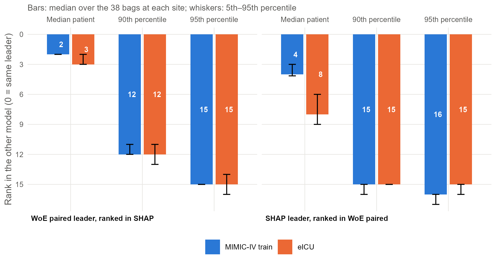

## Implementation and auditability

The pipeline is implemented in R as a graph of targets, and the application to the test set and to eICU is carried out by runners that
read a frozen bundle of parameters and fit nothing. We drew one object interaction chart for each analytical arm, naming the functions,
the stored objects and the file each function lives in. We hold each chart to the call graph obtained with R's own parser:
`docs/figs/callgraph_check.py` fails when a reachable function is missing from a chart, or when an arrow has no corresponding call.

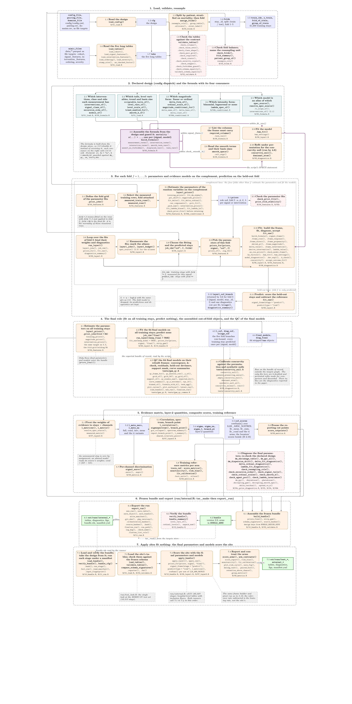

Other charts: [gradient-boosted comparators](paper/figs/chart_boosters.pdf) ·
[severity baselines](paper/figs/chart_severity.pdf) · [attribution](paper/figs/chart_attribution.pdf) · [attribution external](paper/figs/chart_attribution_eicu.pdf)

## Data access and use of large language models

MIMIC-IV version 3.1 and eICU-CRD version 2.0 are available through PhysioNet to credentialed users who sign their data use
agreements, and no data are included in this repository. The patient cards use the eICU-CRD demo, which is released under the Open
Database License.

The code was developed with Claude Code. No patient-level or stay-level data entered any model context: the models wrote scripts that
ran locally, and only aggregate output, such as counts and summaries, returned to them. A permission guard blocked row-level access and
network transfer of the data at the tool boundary. The declarations of the paper give the full statement.

## Repository layout

| Path | Contents |
|---|---|
| `sql/mimiciv/`, `sql/eicu/` | BigQuery extraction, one file per stage |
| `sql/eicu_demo/` | the eICU extraction retargeted to the open demo, generated by `make_demo_sql.py` |
| `R/` | the pipeline: loading, random variables, formulas, evidence models, metrics, comparators, bundle, attribution |
| `_targets.R` | the target graph of the pipeline |
| `run/` | runners: `internal.R` (training), `test_look.R` (single test-set look), `external.R` (eICU), `patient_card.R` |
| `tests/` | checks, diagnostics, and the attribution replicate generator and metrics |
| `config/` | the fitted design (`config.yml`), runner settings and the measurement–intervention pairing |
| `paper/` | figure scripts (`make_*.R`) and the figures and charts shown here (`paper/figs/`) |
| `docs/figs/` | chart sources (`pipeline_*.tex`) and the call-graph check (`callgraph_parse.R`, `callgraph_check.py`) |
| `demo/eicu_demo/` | the CSV-to-parquet conversion used for the demo tables |

## Requirements

- Google BigQuery with PhysioNet credentialed access to MIMIC-IV 3.1 and eICU-CRD 2.0.
- R 4.5 with targets, mgcv, xgboost, arrow, yaml, qs2, digest, MASS, ggplot2, patchwork, scales, ragg and ggrepel. We used mgcv 1.9-4,
  xgboost 3.1.2 and targets 1.12.0. There is no lockfile.
- Python 3 (standard library only) for the demo SQL generator and the call-graph check.
- pdflatex, for the charts.

## Running the pipeline

The steps below are in the order in which we ran them. Each run writes a new time-stamped folder,
`out/runs/<prefix>_<YYYYmmddTHHMMSS>/`, and later steps read earlier runs through config entries and script defaults that name our runs
of record. A rerun therefore updates those entries as it goes, and the table below lists them.

### Paths to update between steps

| File (line) | Pinned to | Replace with the output of |
|---|---|---|
| `config/internal.yml` (114) `test_look.bundle` | `internal_20260909T112643/bundle.qs2` | step 4 |
| `config/external.yml` (17) `bundle` | same bundle | step 4 |
| `config/external_demo.yml` (15) `bundle` | same bundle | step 4 |
| `config/attribution.yml` (48) `bundle` | same bundle | step 4 |
| `config/gam_qc.yml` (23) `bundle` | same bundle | step 4 |
| `config/gam_qc.yml` (31) `concurvity_null` | `cnull_20260909T113509` | step 5 (`tests/concurvity_null.R`) |
| `config/gam_qc.yml` (37) `attrgen` | `attrgen_20260909T115047` | step 8 (`tests/attr_replicates.R`) |
| `config/attribution_eval.yml` (142–144) `gate.*` | three older reference runs | needed only for `tests/attr_metrics.R --gate`, a code-equivalence check |
| `config/attribution_eval.yml` (172) `ladder.run` | `""` | keep empty, so that the generator refits |
| `tests/attr_bands.R` (38) default `--store` | `attrgen_20260909T115047` | step 8 (or pass `--store`) |
| `tests/attr_external_bags.R` (88) default `--internal` | `attrgen_20260909T115047` | step 8, the MIMIC-IV generator (or pass `--internal`) |
| `tests/attr_transport_join.R` (32) default `--mimic` | `attrmetrics_20260909T165755` | step 8, the MIMIC-IV metrics (or pass `--mimic`) |
| `tests/attr_collapse_unmeasured.R` (47–49) defaults `--eicu`, `--mimic`, `--hosp` | `attrextgen_20261006T082355`, `attrgen_20260909T115047`, `attrhosp_20261006T133213` | step 8, the eICU arm (or pass all three) |
| `run/patient_card.R` (78) default `--qc-run` | `gamqc_20260909T180107` | step 8, the second `gam_qc` pass (or pass `--qc-run`) |
| `paper/make_anchored_curves.R` (19) | `gamqc_20260909T180107` | step 8, the second `gam_qc` pass |
| `paper/make_atlas.R` (24) | `gamqc_20260909T180107` | step 8, the second `gam_qc` pass |
| `paper/make_card_figure.R` (15) | `gamqc_20260909T180107` | step 8, the second `gam_qc` pass |
| `paper/make_figures.R` (13–22) | internal, test, external, attrmetrics, attrext, attrmetricsext and gamqc runs | steps 4, 6, 7 and 8 |
| `paper/make_signal_auroc_meas.R` (`REF`) | `internal_20260909T112643` | step 4 |

Several older scripts under `tests/` (for example `attribution_margin.R`, `attribution_ties.R`, `coupling_*.R`) also name earlier runs.
They are records of our development and are not part of the run.

### 1. Extraction in BigQuery

The SQL runs in BigQuery, one file at a time, in the order below, since each stage reads tables written by the stages before it. The
queries read the PhysioNet datasets and write to our own project names, `mimic-iv-ext-icumort-1.mimiciv_ext_icumort_1` and
`eicu-ext.eicu_ext_data`, which you need to replace with your own project and dataset.

MIMIC-IV (`sql/mimiciv/`):
1. `v2_01_cohort_mimiciv.sql`
2. `v2_02a_agents_mimiciv.sql`
3. `v2_03a_signals_hourly_raw.sql`
4. `v2_02b_interventions_mimiciv.sql`
5. `v2_03b_signals_hourly_binned.sql`
6. `v2_04_hourly_gcs_mimiciv.sql`
7. `v2_05_features_mimiciv_rev3.sql`
8. `v2_06_severity_mimiciv.sql`

eICU (`sql/eicu/`):
1. `v2_01_cohort_eicu.sql`
2. `v2_01b_cohort_attrition_eicu.sql`
3. `v2_02a_agents_eicu.sql`
4. `v2_03a_signals_hourly_raw_eicu.sql`
5. `v2_02b_interventions_eicu.sql`
6. `v2_03b_signals_hourly_binned_eicu.sql`
7. `v2_04_hourly_gcs_eicu.sql`
8. `v2_05_features_eicu.sql`
9. `v2_06_severity_eicu.sql`

The files under `archived_sql_files/` and `other_audits/`, and the eICU discovery and audit files, are records of our development and
are not part of the run. For the demo, `python sql/eicu_demo/make_demo_sql.py` regenerates the demo SQL from the eICU files.

### 2. Export to parquet

Download each final table and save it as parquet under `data/`, with the file names that `config/config.yml` and `config/external.yml`
expect:
- `data/mimiciv/`: `v2_cohort_mimiciv`, `v2_features_signals_mimiciv`, `v2_intervention_features_mimiciv`, `v2_severity_mimiciv`;
- `data/eicu/`: `v2_cohort_eicu`, `v2_features_signals_eicu`, `v2_intervention_features_eicu`, `v2_severity_eicu`,
  `v2_cohort_hospital_eicu`.

We did this step by hand, and `demo/eicu_demo/convert_to_parquet.R` shows the conversion from CSV. The `ordering` entry in
`config/config.yml` points to an optional audit table that the current extraction does not write, and you can remove that line.

### The analytical pipeline

On our machine, a Windows laptop with R 4.5.2, the steps from here to the end of the attribution analysis took about 8 hours, with the
concurvity null running alongside the other steps, and about 12 hours when run one after another. The eICU reproducibility arm of step 8
adds about 3.5 hours.

### 3. Checks before fitting (seconds)

`Rscript tests/smoke.R`

### 4. Training and internal validation (about 1 hour)

`Rscript run/internal.R`

This builds the target graph on MIMIC-IV and exports `out/runs/internal_<time>/`, which holds the tables, the diagnostics and the
frozen `bundle.qs2`. The diagnostics of the likelihood models of the random variables (Dirichlet-multinomial shrinkage, the conditional
means and the ordinal model of the tail extremity, the intensity models, and their fold-to-fold stability) are computed here and
exported to `diagnostics/`. Then set the `bundle` entries listed above to the new bundle.

### 5. Model diagnostics

Likelihood models of the random variables:
- `Rscript tests/prior_fit.R` (`--selftest` runs on synthetic counts only);
- `Rscript tests/delta_ordinal.R` (`--synth` runs the synthetic sections only);
- `Rscript tests/conditional_review.R` (about 1 minute);
- `Rscript tests/conditional_ablation.R` (about 12 minutes).

Evidence models:
- `Rscript tests/concurvity_null.R` (about 4 hours; it can run alongside steps 6 to 8);
- `Rscript tests/gam_qc.R` (about 25 minutes).

### 6. The test set, once (3 minutes)

`Rscript run/test_look.R`

We scored the held-out test set once, after the design of the study was frozen, and this step is meant to be run once.

### 7. External validation (about 20 minutes)

`Rscript run/external.R` (`--no-hospital` for the pooled analysis only)

### 8. Attribution and reproducibility (about 10 hours)

**MIMIC-IV (about 6.5 hours).**

1. `Rscript tests/attr_replicates.R --check-specs` (seconds)
2. `Rscript tests/attr_replicates.R --levels spec,seed,sample` (about 5 hours; resumable with `--resume out/runs/attrgen_<time>`)
3. `Rscript tests/attr_metrics.R out/runs/attrgen_<time>` (about 1 hour)
4. `Rscript tests/attr_bands.R --store out/runs/attrgen_<time> --bundle <bundle>` (8 minutes)
5. `Rscript tests/attr_external.R --mimic out/runs/attrmetrics_<time>` (2 minutes), the frozen bundle applied once at eICU, which the
   eICU arm below also holds as its anchor
6. Set `concurvity_null` and `attrgen` in `config/gam_qc.yml`, then `Rscript tests/gam_qc.R --external out/runs/external_<time>`
   (about 25 minutes)

**eICU (about 3.5 hours).** The three attribution methods of the paper (the measurement and paired weights of evidence, and SHAP of the
constructed booster) are refitted whole, without folds, on the same 38 bags as the MIMIC-IV generator, with the random-variable parameters
held at their final values, and each refit is applied to the eICU cohort. The metrics are then computed exactly as at MIMIC-IV. Nothing is
fitted on eICU outcomes, no model is saved, and no target is invalidated. Run the steps one after another; R's peak memory was below 3 GB.

1. `Rscript tests/attr_external_bags.R --plan-only --internal out/runs/attrgen_<time>` (seconds): checks that the bags match the MIMIC-IV
   store and prints the planned replicates
2. `Rscript tests/attr_external_bags.R --verify-anchor --internal out/runs/attrgen_<time>` (about 2 hours 15 minutes; resumable with
   `--resume out/runs/attrextgen_<time>`). `--verify-anchor` first refits every evidence model and the booster on the whole training set,
   and stops unless they reproduce the frozen bundle at eICU.
3. `Rscript tests/attr_metrics.R --site eicu out/runs/attrextgen_<time>` (about 45 minutes), which writes `out/runs/attrmetricsext_<time>/`
4. `Rscript tests/attr_bands.R --store out/runs/attrextgen_<time> --methods llr_full,llr_meas` (about 13 minutes); the bundle is read from
   the store
5. `Rscript tests/attr_transport_join.R --mimic out/runs/attrmetrics_<time> --eicu out/runs/attrmetricsext_<time>` (seconds), which sets
   every eICU table beside its MIMIC-IV counterpart
6. `Rscript tests/attr_hospital_disagreement.R --store out/runs/attrextgen_<time> --metrics out/runs/attrmetricsext_<time>` (about 18
   minutes), the same metrics within each eICU hospital that meets the inclusion floors
7. `Rscript tests/attr_collapse_unmeasured.R --eicu out/runs/attrextgen_<time> --mimic out/runs/attrgen_<time> --hosp
   out/runs/attrhosp_<time>` (under a minute), the SHAP-leader collapse split by measured and unmeasured leaders

If their eICU run options are left out, steps 5 and 6 read the latest complete `attrextgen` and `attrmetricsext` runs.

The evaluation library `R/14_attribution_eval.R` is loaded by these scripts, and it is not run on its own.

### 9. Patient cards (seconds per card)

`Rscript run/patient_card.R --site eicu_demo --profiles --terms-signal resp_rate --qc-run out/runs/gamqc_<time>
--anchor-n paper/figs/coefs/anchor_n.csv`

### 10. Figures and the call-graph check (minutes)

1. `Rscript paper/make_anchor_n.R`, `Rscript paper/make_figure_coefs.R`, `Rscript paper/make_anchored_curves.R`
2. `Rscript paper/make_signal_auroc_meas.R`, which reproduces the exported joint per-channel AUROC exactly before it writes the
   measurement-only one
3. `Rscript paper/make_card_figure.R out/runs/card_<time>`
4. `Rscript paper/make_figures.R` and `Rscript paper/make_atlas.R`, after setting the run identifiers at the top of each script
5. `python docs/figs/callgraph_check.py`, which parses the source, compares each chart with the call graph, and exits with an error
   on any mismatch

## Citation

The preprint citation will follow.
